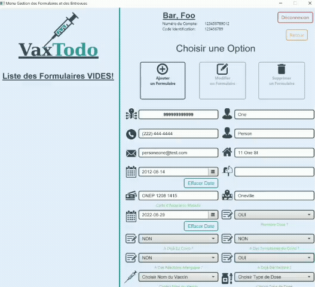

# VaxTodo

Vaccination-scheduling GUI application prototype created with two teammates for a Software Engineering class.

Project website: https://chrislng.github.io/VaxTodo/

The application UI is in French, while the code itself is in English.

The `\doc\` folder includes the JavaDoc, the Class, Activity and Sequence UML Diagrams done with Visual Paradigm inside the `\VPP\` folder, the specifications, and the final report, translated to English, containing information about the Use Cases, the UML diagrams, some JUnit Unit Tests, and the JIRA Scrum board, along with other information. It also includes the website files.

[Javadoc Documentation](https://chrislng.github.io/VaxTodo/JavaDoc/index.html)

[Specifications in html form](https://chrislng.github.io/VaxTodo/specifications.html)

[Specifications in markdown form](./doc/specifications.md)

[Project Report](https://chrislng.github.io/VaxTodo/report.html)

## Features

- Book a vaccination period.
- Manage employee, volunteer and visitor accounts.
- Manage appointments.
- Add important vaccination-related information in a visitor's account and follow up on it.

### First Launch

To use the application, Java 17+ is required. If it is not installed one the user's computer, a pop-up message will appear informing the user about the issue and a browser page will open with the OpenJDK installation page.

On first launch, a folder called `VaxTodo_Folder` will be created containing the initial employee and volunteer test accounts. Additional employee, volunteer and visitor accounts will be stored in that folder, as well as appointments, forms and logs.

### Login

To initially log in to the application, one of the following logins are used:

- Employee Role
  - username: `111111111` | password: `Password1!`
- Volunteer role
  - username: `111111111` | password: `Password1!`

These accounts are only meant for testing purposes and for creating the main accounts. A message will appear informing the user as such and advising to create a main account.

### Main Menu (Employee)

From the main menu, in the employee role, you can click on the option of your choice.

At any time you can click on the "back" button to go back or the "logout" button to return to the login screen.

- Visitor Management: Access the list of visitors and add, modify or delete a visitor.
- Interview / Form: Access the list of all visitor forms. It is possible to add, modify and delete them. The forms ask essential questions for each visitor.

- Consultation of planned visits: Access the list of planned visits and add, modify or delete a visit. It is also possible to send a reminder notification.

- Employee management: Access the list of employees and add, modify or delete an employee.

- Volunteer management: Access the list of volunteers and add, modify or delete a volunteer.

### Main Menu (Volunteer)

From the main menu, in the volunteer role, you can click on the option of your choice.

At any time you can click on the "back" button to go back or the "logout" button to return to the login screen.

- Visitor List Menu: Search and view the information of a visitor. It is not possible to make changes to this list.
- Viewing the list of visits: Access the list of planned visits, possibility to add, modify or delete a visit. It is also possible to send a reminder notification.

No management of employees or volunteers is possible while logged-in as a volunteer.

### Some additional information

- The application has several validations (input validation, read and write validation on files).
- Encryption of passwords and files with AES-256 encryption.
- Isolated code and use of inheritance and abstraction.
